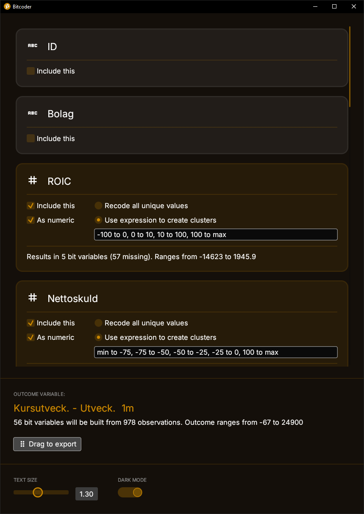

# Bitcoder

Bit string file creation by categorizing value-based text data. 
User interface made with [egui](https://github.com/emilk/egui).

> **DISCLAIMER**: this application is a hobby project and should not be used for production use cases. It is provided as-is and is not likely to be maintained regurlarly.

## Usage

This application expects a standard CSV file as input. Drag and drop it on the main area to load it. First row must contain variable names. All values (including variable names), are in quotes if they are strings and without if they are numeric. Inside the application conversion can be made through the "As numeric" checkbox. 

## Future
* Add visualization of histogram to make it easier to pick good clusters.
* Add "automatic" to expression and parsing to automatically create some kind of well-distributed clusters. Perhaps based on frequency?. Maybe as an option instead?
